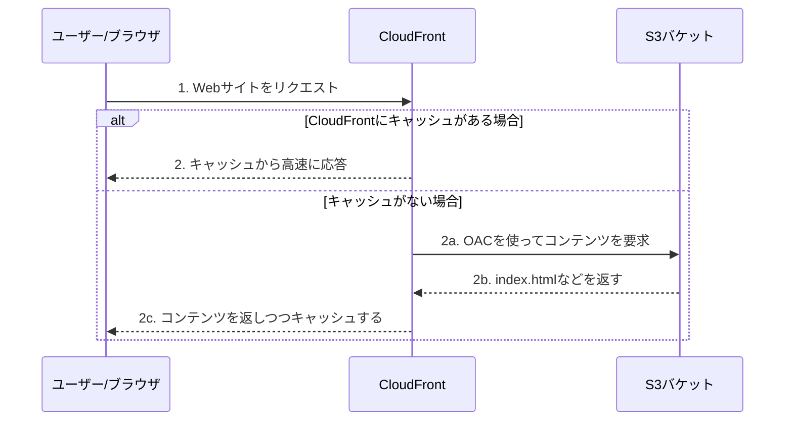
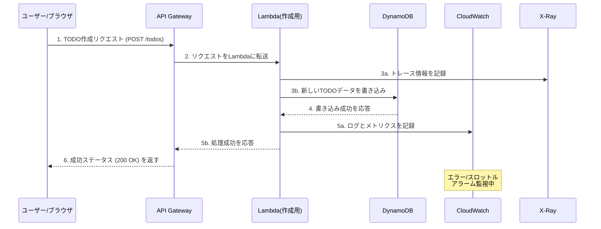

# CDK TODO Application

これはAWS CDK (TypeScript) を使用して構築された、シンプルなサーバーレスTODOアプリケーションです。
学習目的で作成されました。

## アーキテクチャと動作フロー

このアプリケーションは、サーバーレスなバックエンドAPIと、CloudFront経由で高速配信されるフロントエンドで構成されるフルスタックアプリケーションです。

採用しているアーキテクチャと、一般的なNode.jsサーバーでAPIを構築する場合との詳しい比較については、[`docs/architecture_comparison.md`](docs/architecture_comparison.md)を参照してください。

**使用するAWSサービス:**

- **Amazon S3:** フロントエンドの静的ファイル（HTML/CSS/JS）を格納します。
- **Amazon CloudFront:** S3のコンテンツを世界中に高速かつ安全に配信するCDNです。Origin Access Control (OAC) でS3へのアクセスを制御します。
- **Amazon API Gateway:** TODOアイテムを操作するためのREST APIエンドポイントを提供します。CORS設定によりクロスオリジンリクエストに対応しています。
- **AWS Lambda:** APIリクエストを処理するビジネスロジックを実行します。ログは1週間保持され、X-Rayトレーシングが有効化されています。
- **Amazon DynamoDB:** TODOアイテムを永続化するNoSQLデータベースです。(詳しい解説は [`docs/database_choice.md`](docs/database_choice.md) を参照)
- **Amazon CloudWatch:** Lambda関数のエラーとスロットリングを監視し、アラームを発生させます。
- **AWS X-Ray:** Lambda関数の実行をトレースし、パフォーマンス分析とボトルネックの特定を支援します。

### フロー1: フロントエンド（Webサイト）へのアクセス

ユーザーがブラウザでCloudFrontのURLにアクセスし、Webページが表示されるまでの流れです。



### フロー2: バックエンドAPIの呼び出し（TODO作成時）

Webサイト上でユーザーが「TODOを作成」ボタンなどを押し、APIが呼び出される際の裏側の流れです。



## プロジェクト構成

- `lib/cdk-study-stack.ts`: すべてのインフラストラクチャを定義するCDKスタックです。
- `lambda/create.ts`: TODOアイテムを作成するLambda関数のソースコードです。
- `lambda/get.ts`: TODOアイテムを一覧取得するLambda関数のソースコードです。
- `lambda/get-one.ts`: TODOアイテムを1件取得するLambda関数のソースコードです。
- `test/cdk-study.test.ts`: インフラ定義を検証するテストコードです。

## 便利なコマンド

* `npm run build`: TypeScriptをJavaScriptにコンパイルします。
* `npm run watch`: ファイルの変更を監視して自動的にコンパイルします。
* `npm run test`: `jest` を使用して単体テストを実行します。テストの詳細については [`docs/testing_strategy.md`](docs/testing_strategy.md) を参照してください。
* `npx cdk deploy`: このスタックをデフォルトのAWSアカウント/リージョンにデプロイします。
* `npx cdk diff`: デプロイ済みのスタックと現在の状態を比較します。
* `npx cdk synth`: 合成されたCloudFormationテンプレートを出力します。

> **Note: 初回デプロイ前の準備 (Bootstrap)**
> 
> 初めてCDKをデプロイするAWSアカウントとリージョンの組み合わせでは、事前に一度だけ `npx cdk bootstrap` を実行する必要があります。これはCDKがデプロイ作業に使うS3バケットなどを作成する準備コマンドです。
> 
> ちなみに、これはWebデザインで使われる「CSSのBootstrap」とは全く関係ありません。

## デプロイ後の確認

`npx cdk deploy` が成功すると、`Outputs` として以下のような2つのURLが出力されます。

*   `CdkStudyStack.CloudFrontURL`: フロントエンドのWebサイトにアクセスするためのURLです。ブラウザで開いて確認します。
*   `CdkStudyStack.TodoApiEndpoint...`: バックエンドAPIのエンドポイントURLです。

**出力例:**
```
Outputs:
CdkStudyStack.CloudFrontURL = https://xxxxxxxxxxxxxx.cloudfront.net
CdkStudyStack.TodoApiEndpointC1E16B6C = https://xxxxxxxxxx.execute-api.ap-northeast-1.amazonaws.com/prod/
```

## 本番環境へのデプロイ

このアプリケーションを本番環境で運用する際の、カスタムドメイン設定に関する考慮事項については、[`docs/production_deployment.md`](docs/production_deployment.md) を参照してください。