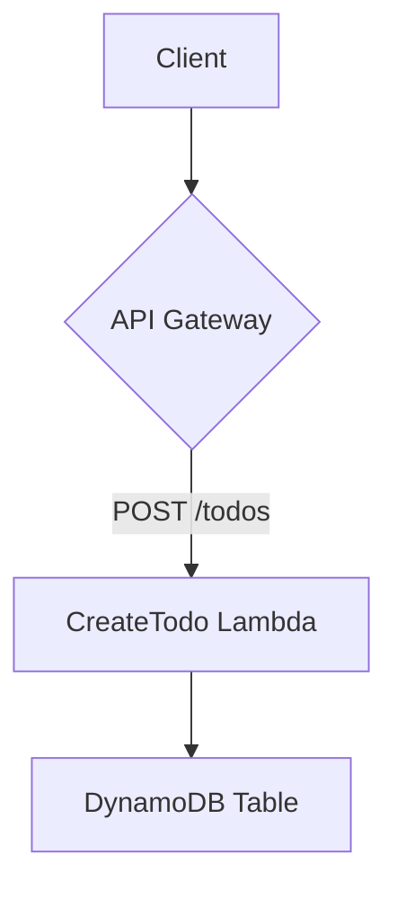

# CDK TODO Application

これはAWS CDK (TypeScript) を使用して構築された、シンプルなサーバーレスTODOアプリケーションです。
学習目的で作成されました。

## アーキテクチャ

このアプリケーションは、以下のAWSサービスを使用しています。

- **Amazon API Gateway:** TODOアイテムを作成するためのREST APIエンドポイント (`POST /todos`) を提供します。
- **AWS Lambda:** API Gatewayからのリクエストを処理し、DynamoDBとやり取りするビジネスロジックを実行します。
- **Amazon DynamoDB:** TODOアイテムを永続化するためのNoSQLデータベースです。

### リクエストフロー

1.  クライアントが `POST /todos` にリクエストを送信します。
2.  API Gatewayがリクエストを受け取り、`CreateTodo` Lambda関数をトリガーします。
3.  Lambda関数がリクエストボディをパースし、新しいTODOアイテムを作成します。
4.  Lambda関数がDynamoDBテーブルに新しいアイテムを書き込みます。
5.  成功すると、Lambda関数は `201 Created` レスポンスを返します。

## プロジェクト構成

- `lib/cdk-study-stack.ts`: すべてのインフラストラクチャを定義するCDKスタックです。
- `lambda/create.ts`: TODOアイテムを作成するLambda関数のソースコードです。
- `test/cdk-study.test.ts`: インフラ定義を検証するテストコードです。

## 便利なコマンド

* `npm run build`: TypeScriptをJavaScriptにコンパイルします。
* `npm run watch`: ファイルの変更を監視して自動的にコンパイルします。
* `npm run test`: `jest` を使用して単体テストを実行します。
* `npx cdk deploy`: このスタックをデフォルトのAWSアカウント/リージョンにデプロイします。
* `npx cdk diff`: デプロイ済みのスタックと現在の状態を比較します。
* `npx cdk synth`: 合成されたCloudFormationテンプレートを出力します。