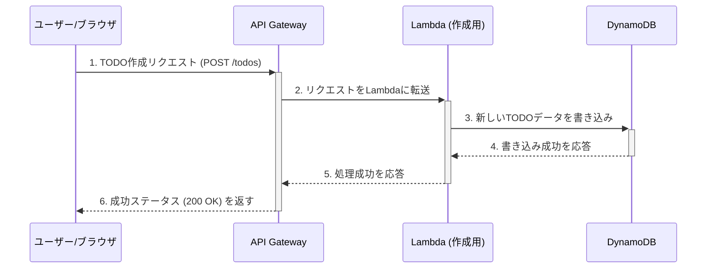

# CDK TODO Application

これはAWS CDK (TypeScript) を使用して構築された、シンプルなサーバーレスTODOアプリケーションです。
学習目的で作成されました。

## アーキテクチャと動作フロー

このアプリケーションは、サーバーレスなバックエンドAPIと、CloudFront経由で高速配信されるフロントエンドで構成されるフルスタックアプリケーションです。

採用しているアーキテクチャと、一般的なNode.jsサーバーでAPIを構築する場合との詳しい比較については、[`docs/architecture_comparison.md`](docs/architecture_comparison.md)を参照してください。

**使用するAWSサービス:**

- **Amazon S3:** フロントエンドの静的ファイル（HTML/CSS/JS）を格納します。
- **Amazon CloudFront:** S3のコンテンツを世界中に高速かつ安全に配信するCDNです。
- **Amazon API Gateway:** TODOアイテムを操作するためのREST APIエンドポイントを提供します。
- **AWS Lambda:** APIリクエストを処理するビジネスロジックを実行します。
- **Amazon DynamoDB:** TODOアイテムを永続化するNoSQLデータベースです。(詳しい解説は [`docs/database_choice.md`](docs/database_choice.md) を参照)
- **Amazon CloudWatch:** Lambda関数のエラーを監視し、アラームを発生させます。

### フロー1: フロントエンド（Webサイト）へのアクセス

ユーザーがブラウザでCloudFrontのURLにアクセスし、Webページが表示されるまでの流れです。

```mermaid
sequenceDiagram
    participant ユーザー/ブラウザ
    participant CloudFront
    participant S3バケット

    ユーザー/ブラウザ->>+CloudFront: 1. Webサイトをリクエスト
    alt CloudFrontにキャッシュがある場合
        CloudFront-->>-ユーザー/ブラウザ: 2. キャッシュから高速に応答
    else キャッシュがない場合
        CloudFront->>+S3バケット: 2a. OAIを使ってコンテンツを要求
        S3バケット-->>-CloudFront: 2b. index.htmlなどを返す
        CloudFront-->>-ユーザー/ブラウザ: 2c. コンテンツを返しつつキャッシュする
    end
```

### フロー2: バックエンドAPIの呼び出し（TODO作成時）

Webサイト上でユーザーが「TODOを作成」ボタンなどを押し、APIが呼び出される際の裏側の流れです。



## プロジェクト構成

- `lib/cdk-study-stack.ts`: すべてのインフラストラクチャを定義するCDKスタックです。
- `lambda/create.ts`: TODOアイテムを作成するLambda関数のソースコードです。
- `lambda/get.ts`: TODOアイテムを一覧取得するLambda関数のソースコードです。
- `lambda/get-one.ts`: TODOアイテムを1件取得するLambda関数のソースコードです。
- `test/cdk-study.test.ts`: インフラ定義を検証するテストコードです。

## 便利なコマンド

* `npm run build`: TypeScriptをJavaScriptにコンパイルします。
* `npm run watch`: ファイルの変更を監視して自動的にコンパイルします。
* `npm run test`: `jest` を使用して単体テストを実行します。テストの詳細については [`docs/testing_strategy.md`](docs/testing_strategy.md) を参照してください。
* `npx cdk deploy`: このスタックをデフォルトのAWSアカウント/リージョンにデプロイします。
* `npx cdk diff`: デプロイ済みのスタックと現在の状態を比較します。
* `npx cdk synth`: 合成されたCloudFormationテンプレートを出力します。