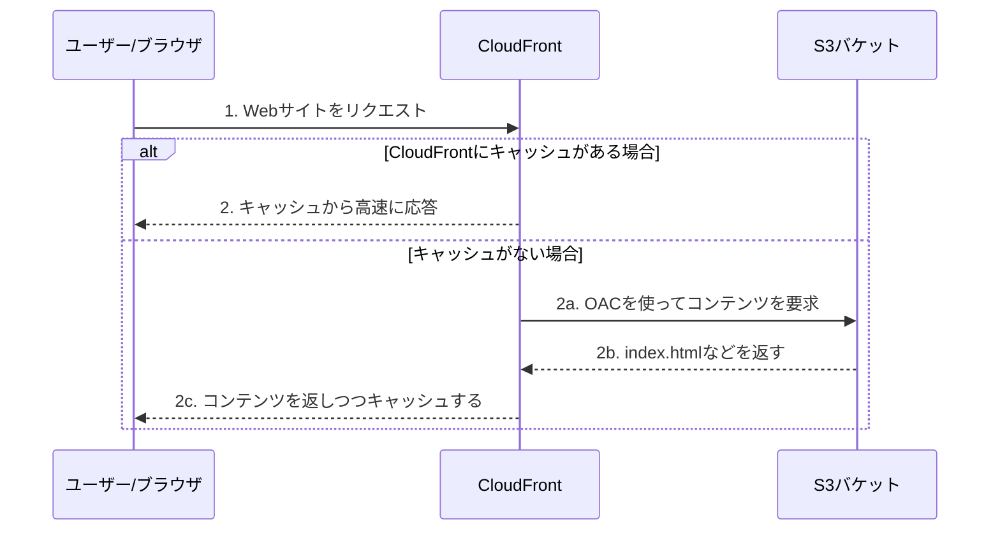
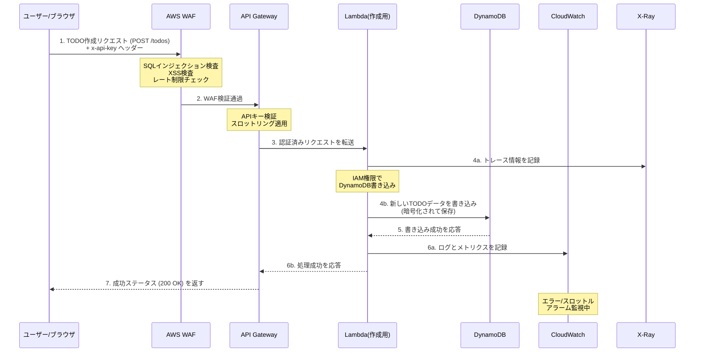

# CDK TODO Application

これはAWS CDK (TypeScript) を使用して構築された、シンプルなサーバーレスTODOアプリケーションです。
学習目的で作成されました。

## アーキテクチャ

このプロジェクトには2つのアーキテクチャパターンが含まれています：

### 1. サーバーレスアーキテクチャ（メインスタック）
CloudFront + API Gateway + Lambda + DynamoDB を使用した、完全サーバーレスなアプリケーションです。

### 2. ALB + ECS Fargateアーキテクチャ（学習用）
Application Load Balancer + ECS Fargate を使用した、コンテナベースのアプリケーションです。
詳細は [`docs/alb_ecs_architecture.md`](docs/alb_ecs_architecture.md) を参照してください。

**関連ドキュメント:**
- [SubnetとIPアドレスの関係](docs/subnet_and_ip_addressing.md) - VPC、Subnet、CIDR表記の基礎知識

## アーキテクチャと動作フロー

このアプリケーションは、サーバーレスなバックエンドAPIと、CloudFront経由で高速配信されるフロントエンドで構成されるフルスタックアプリケーションです。

採用しているアーキテクチャと、一般的なNode.jsサーバーでAPIを構築する場合との詳しい比較については、[`docs/architecture_comparison.md`](docs/architecture_comparison.md)を参照してください。

**使用するAWSサービス:**

### コアサービス
- **Amazon S3:** フロントエンドの静的ファイル（HTML/CSS/JS）を格納します。SSE-S3暗号化、SSL強制、パブリックアクセス完全ブロックを実装。
- **Amazon CloudFront:** S3のコンテンツを世界中に高速かつ安全に配信するCDNです。Origin Access Identity (OAI) でS3へのアクセスを制御し、セキュリティヘッダーを自動付与します。
- **Amazon API Gateway:** TODOアイテムを操作するためのREST APIエンドポイントを提供します。APIキー認証、スロットリング、詳細ログ、X-Rayトレーシングを有効化。
- **AWS Lambda:** APIリクエストを処理するビジネスロジックを実行します。ログは1週間保持され、X-Rayトレーシングが有効化されています。
- **Amazon DynamoDB:** TODOアイテムを永続化するNoSQLデータベースです。AWS管理暗号化とポイントインタイムリカバリを有効化。(詳しい解説は [`docs/database_choice.md`](docs/database_choice.md) を参照)

### セキュリティ・監視サービス
- **AWS WAF:** API Gatewayを保護するWebアプリケーションファイアウォール。SQLインジェクション、XSS、DDoS攻撃を防御します。
- **AWS Secrets Manager:** APIキーなどの機密情報を安全に管理します。自動暗号化、アクセス監査ログ、ローテーション機能を提供。
- **Amazon CloudWatch:** Lambda関数のエラーとスロットリングを監視し、アラームを発生させます。
- **AWS X-Ray:** Lambda関数の実行をトレースし、パフォーマンス分析とボトルネックの特定を支援します。

詳細なセキュリティ機能については、[`docs/security.md`](docs/security.md) を参照してください。

### フロー1: フロントエンド（Webサイト）へのアクセス

ユーザーがブラウザでCloudFrontのURLにアクセスし、Webページが表示されるまでの流れです。



### フロー2: バックエンドAPIの呼び出し（TODO作成時）

Webサイト上でユーザーが「TODOを作成」ボタンなどを押し、APIが呼び出される際の裏側の流れです。
セキュリティの多層防御により、複数のチェックポイントを通過します。



## プロジェクト構成

- `lib/cdk-study-stack.ts`: すべてのインフラストラクチャを定義するCDKスタックです。
- `lambda/create.ts`: TODOアイテムを作成するLambda関数のソースコードです。
- `lambda/get.ts`: TODOアイテムを一覧取得するLambda関数のソースコードです。
- `lambda/get-one.ts`: TODOアイテムを1件取得するLambda関数のソースコードです。
- `test/cdk-study.test.ts`: インフラ定義を検証するテストコードです。

## 便利なコマンド

* `npm run build`: TypeScriptをJavaScriptにコンパイルします。
* `npm run watch`: ファイルの変更を監視して自動的にコンパイルします。
* `npm run test`: `jest` を使用して単体テストを実行します。テストの詳細については [`docs/testing_strategy.md`](docs/testing_strategy.md) を参照してください。
* `npx cdk deploy`: このスタックをデフォルトのAWSアカウント/リージョンにデプロイします。
* `npx cdk diff`: デプロイ済みのスタックと現在の状態を比較します。
* `npx cdk synth`: 合成されたCloudFormationテンプレートを出力します。

> **Note: 初回デプロイ前の準備 (Bootstrap)**
> 
> 初めてCDKをデプロイするAWSアカウントとリージョンの組み合わせでは、事前に一度だけ `npx cdk bootstrap` を実行する必要があります。これはCDKがデプロイ作業に使うS3バケットなどを作成する準備コマンドです。
> 
> ちなみに、これはWebデザインで使われる「CSSのBootstrap」とは全く関係ありません。

## デプロイ後の確認

`npx cdk deploy` が成功すると、`Outputs` として以下の情報が出力されます。

### 出力される情報

*   `CdkStudyStack.CloudFrontURL`: フロントエンドのWebサイトにアクセスするためのURLです。ブラウザで開いて確認します。
*   `CdkStudyStack.ApiEndpoint`: バックエンドAPIのエンドポイントURLです。
*   `CdkStudyStack.ApiKeyId`: API Keyのリソース ID です（後述の方法で実際のキー値を取得します）。
*   `CdkStudyStack.ApiKeySecretArn`: Secrets ManagerのARNです。

**出力例:**
```
Outputs:
CdkStudyStack.CloudFrontURL = https://xxxxxxxxxxxxxx.cloudfront.net
CdkStudyStack.ApiEndpoint = https://xxxxxxxxxx.execute-api.ap-northeast-1.amazonaws.com/prod/
CdkStudyStack.ApiKeyId = abc123xyz
CdkStudyStack.ApiKeySecretArn = arn:aws:secretsmanager:ap-northeast-1:123456789012:secret:ApiKeySecret-xxxxx
```

### API Keyの取得方法

フロントエンドでAPIを呼び出すには、API Keyが必要です。以下のいずれかの方法で取得してください。

**方法1: AWS CLI**
```bash
aws apigateway get-api-key \
  --api-key <ApiKeyId> \
  --include-value \
  --query 'value' \
  --output text
```

**方法2: AWSマネジメントコンソール**
1. API Gatewayコンソールを開く
2. 左メニューから「APIキー」を選択
3. `TodoApiKey` をクリック
4. 「表示」ボタンをクリックしてキー値を確認

取得したAPI Keyは、HTTPリクエストのヘッダーに以下のように含めます：
```
x-api-key: <取得したAPIキー>
```

## 本番環境へのデプロイ

このアプリケーションを本番環境で運用する際の、カスタムドメイン設定に関する考慮事項については、[`docs/production_deployment.md`](docs/production_deployment.md) を参照してください。