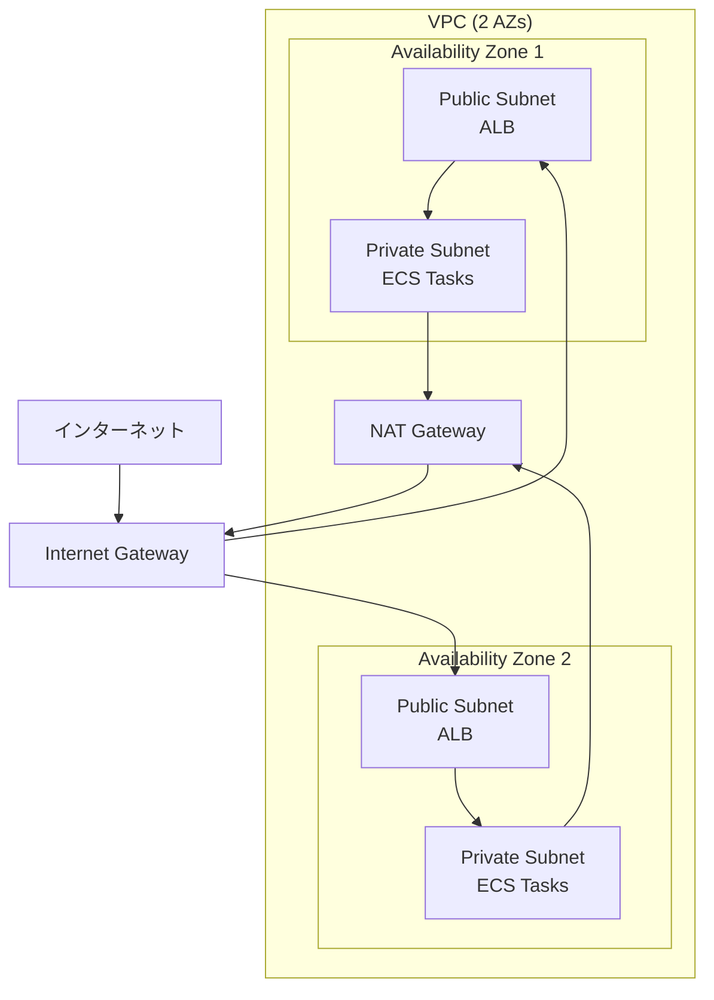
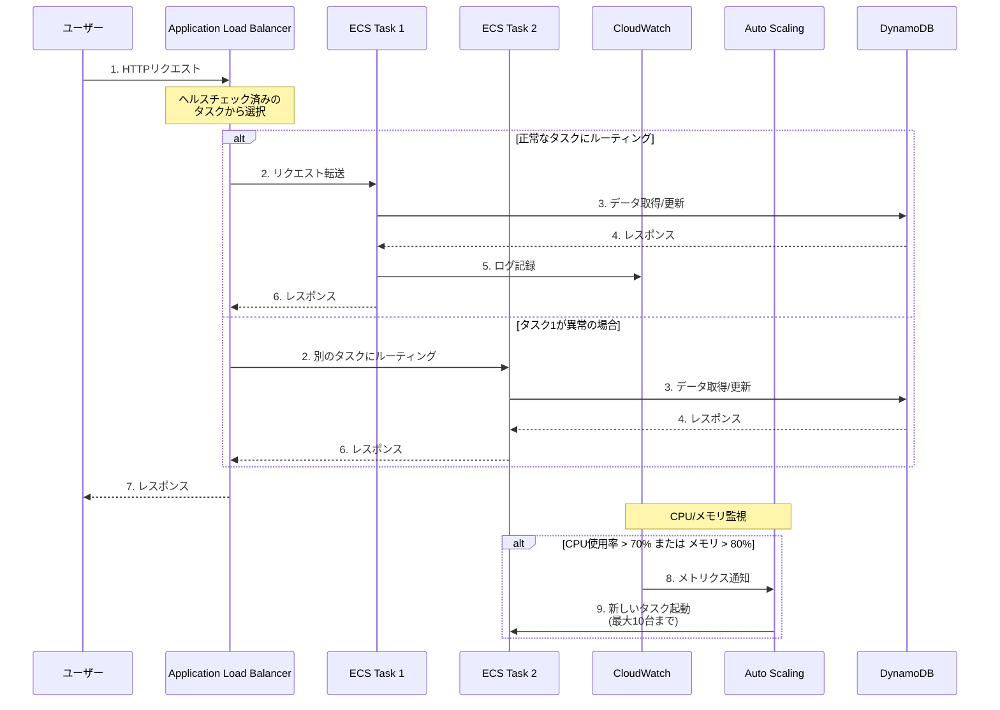
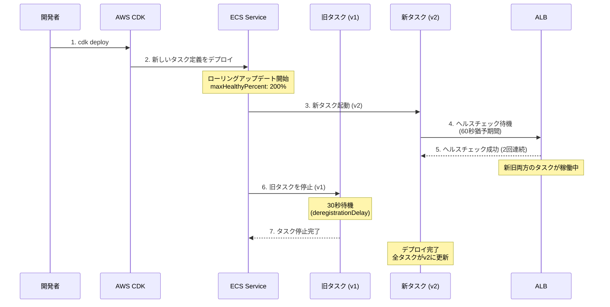
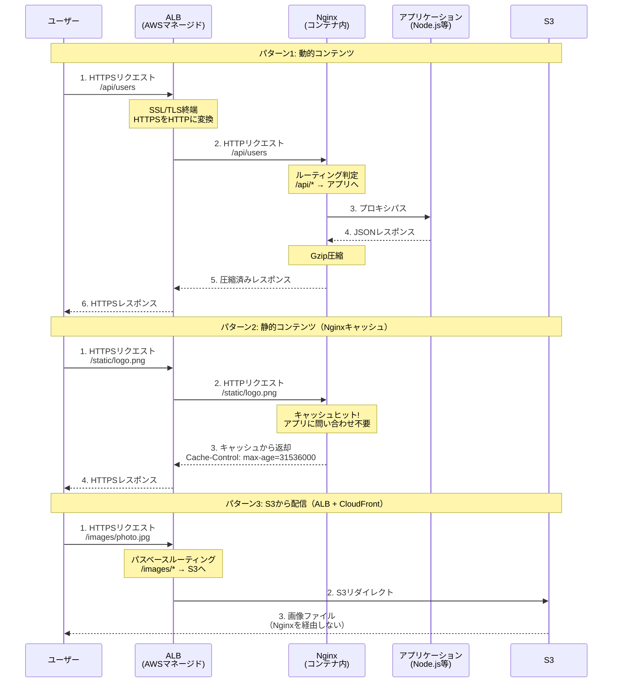
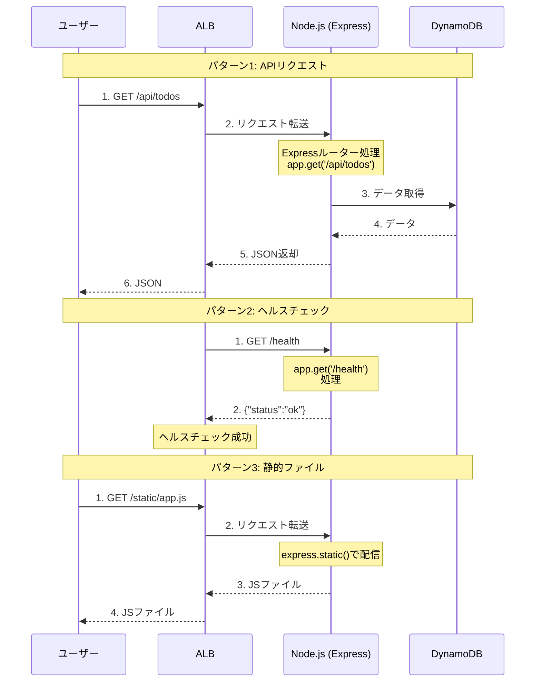

# ALB + ECS Fargate アーキテクチャ

このドキュメントでは、Application Load Balancer (ALB) と ECS Fargate を使用したコンテナベースのアーキテクチャについて説明します。

## 概要

このアーキテクチャは、コンテナ化されたアプリケーションをサーバーレスに実行するためのパターンです。
EC2インスタンスの管理が不要で、コンテナの実行に必要なリソースを指定するだけで動作します。

### 車の運転に例えると

AWSのコンテナ実行方法を、車の運転に例えるとわかりやすいです：

**EC2 = マニュアル車**
- ギア（インスタンスサイズ）を自分で選ぶ
- エンジン（OS）のメンテナンスも自分で
- 細かい制御ができる
- 運転（管理）が大変

**Fargate = オートマ車（このプロジェクトで使用）**
- アクセル（CPU/メモリ）踏むだけ
- ギアチェンジ（スケーリング）は自動
- メンテナンスはディーラー（AWS）任せ
- 楽だけど若干燃費（コスト）悪いことも

**Lambda = 完全自動運転車**
- 目的地（関数）だけ指定
- 運転は全部お任せ
- 乗った時（実行時）だけ課金
- 駐車場代（待機コスト）0円

## アーキテクチャ図

### システム構成図

```
┌─────────────────────────────────────────────────────────────┐
│                         インターネット                        │
└────────────────────────┬────────────────────────────────────┘
                         │
                         │ HTTP/HTTPS
                         v
        ┌────────────────────────────────────┐
        │   Application Load Balancer (ALB)  │
        │         (Public Subnet)            │
        │  - ヘルスチェック: /health         │
        │  - パスベースルーティング          │
        └────────────────┬───────────────────┘
                         │
         ┌───────────────┼───────────────┐
         │               │               │
         v               v               v
    ┌────────┐     ┌────────┐     ┌────────┐
    │ ECS    │     │ ECS    │ ... │ ECS    │
    │ Task 1 │     │ Task 2 │     │ Task N │
    │        │     │        │     │        │
    └────────┘     └────────┘     └────────┘
         │  (Private Subnet)  │         │
         │  1〜10台 (Auto Scaling)      │
         └───────────────┬───────────────┘
                         │
                         │ NAT Gateway経由
                         v
        ┌────────────────────────────────────┐
        │      DynamoDB / 外部API            │
        └────────────────────────────────────┘
```

### ネットワーク構成図



### リクエストフロー



### デプロイフロー（ローリングアップデート）



## 主要コンポーネント

### 1. VPC (Virtual Private Cloud)

**役割:**
- プライベートなネットワーク空間を作成
- リソース間の通信を制御
- インターネットとの接続を管理

**設定:**
- アベイラビリティゾーン: 2つ（高可用性）
- NAT Gateway: 1つ（コスト削減、本番では2推奨）
- サブネット:
  - Public Subnet: ALB配置用（インターネットから直接アクセス可能）
  - Private Subnet: ECS配置用（インターネットから直接アクセス不可）

### 2. Application Load Balancer (ALB)

**役割:**
- 複数のコンテナにトラフィックを分散
- ヘルスチェックで異常なコンテナを自動的に除外
- パスベースルーティング（/api → API、/static → 静的コンテンツ等）
- SSL/TLS終端（HTTPS通信の暗号化/復号化）

**設定:**
- 配置: Public Subnet
- リスナー: HTTP (80)
- セキュリティグループ: インターネットからHTTP/HTTPS許可

#### ALBとプロキシの関係

**ALB = AWSマネージド型のリバースプロキシ + ロードバランサー**

プロキシとは、クライアントとサーバー間の仲介役です。ALBは「リバースプロキシ」として機能し、クライアントからのリクエストを受けて、バックエンド（ECSタスク）に振り分けます。

**一般的なプロキシ（例: Nginx, HAProxy）との比較:**

| 項目 | 一般的なプロキシ（Nginx等） | ALB（マネージドプロキシ） |
|------|--------------------------|------------------------|
| 構築・管理 | 自分でEC2にインストール・設定 | AWSが完全管理 |
| スケーリング | 自分で設定・管理 | 自動スケーリング |
| 高可用性 | 自分で複数台構成 | 標準で高可用性 |
| パッチ適用 | 自分で実施 | AWS任せ |
| カスタマイズ性 | 高い（詳細な設定可能） | 中程度（AWSの範囲内） |
| AWS統合 | 手動で設定 | CloudWatch、WAF等と簡単連携 |
| コスト | インスタンス料金のみ | 使用量ベース課金 |
| 運用負荷 | 高い | 低い |

**要するに:**
- 一般的なプロキシ = 自分で構築・管理、高カスタマイズ可能、運用負荷が高い
- ALB = AWSが運用を全部やってくれるマネージド版、運用が楽、AWS他サービスと簡単連携

**このプロジェクトでは:**
ALBをリバースプロキシとして使用し、インターネットからのリクエストを複数のECSタスクに自動的に振り分けています。

#### ALBとNginxの併用パターン

実際のプロダクション環境では、ALBとNginxを両方使うことがあります。

**構成例:**

```
インターネット
    ↓
  ALB（AWSマネージド）
    ↓
  ECS/EC2上のNginx
    ↓
  アプリケーション
```

**なぜ重複させるのか？**

役割分担することで、それぞれの強みを活かせます：

| レイヤー | 役割 |
|---------|------|
| **ALB（外側）** | SSL/TLS終端、複数サービスへのルーティング、ヘルスチェック、AWS連携（WAF、Cognito等） |
| **Nginx（内側）** | 静的ファイル配信、キャッシュ制御、リクエスト書き換え、Gzip圧縮、レート制限、細かいルーティング |

**シーケンス図:**



**Nginx設定例（コンテナ内）:**

```nginx
# /etc/nginx/nginx.conf

server {
    listen 80;

    # 静的ファイル（Nginxから直接配信）
    location /static/ {
        root /var/www;
        expires 1y;
        add_header Cache-Control "public, immutable";
        gzip_static on;
    }

    # API（アプリケーションにプロキシ）
    location /api/ {
        proxy_pass http://localhost:3000;

        # キャッシュ設定
        proxy_cache my_cache;
        proxy_cache_valid 200 5m;
        proxy_cache_key "$request_uri";

        # レート制限
        limit_req zone=api_limit burst=10;

        # ヘッダー設定
        proxy_set_header X-Real-IP $remote_addr;
        proxy_set_header X-Forwarded-For $proxy_add_x_forwarded_for;
    }

    # ヘルスチェック
    location /health {
        access_log off;
        return 200 "OK";
    }
}
```

**構成パターン比較:**

| 構成 | メリット | デメリット | 適している場合 |
|------|---------|-----------|--------------|
| **ALBのみ**<br/>（このプロジェクト） | シンプル、運用負荷低、コスト安 | 細かい制御ができない | シンプルなAPI、学習目的 |
| **ALB + Nginx** | 役割分担、柔軟な設定、キャッシュ | 複雑、Nginx管理が必要 | 静的ファイル多い、細かい制御が必要 |
| **Nginxのみ（EC2）** | 完全なカスタマイズ、コスト最安 | 高可用性を自分で構築、運用負荷高 | AWS外、完全な制御が必要 |
| **CloudFront + ALB** | CDN、グローバル配信 | コスト高、複雑 | グローバルユーザー、静的ファイル多い |

**実際のプロダクション構成例:**

```
インターネット
    ↓
CloudFront（CDN、静的ファイル）
    ↓
  ALB（SSL終端、ルーティング）
    ↓
  ECS上のNginx（キャッシュ、圧縮）
    ↓
  アプリケーション
    ↓
  RDS / DynamoDB
```

**このプロジェクトの選択:**

シンプルに**ALBのみ**を使用しています。理由：
- 学習目的でシンプルに保つ
- 静的ファイル配信が少ない
- Nginxの管理コストを削減
- ALBの機能だけで十分

#### このプロジェクトの構成: ALB → Node.js Express

このプロジェクトは最もシンプルな構成を採用しています。

**アーキテクチャ図:**

```
インターネット
    ↓
  ALB (Port 80/443)
    ↓
  ECS Fargate
    ↓
  Node.js App (Express: Port 3000)
    ├── APIエンドポイント
    └── 静的ファイル配信
```

**リクエストフロー:**



**Express コード例:**

```javascript
// app.js
const express = require('express');
const app = express();

// 静的ファイル配信
app.use('/static', express.static('public'));

// ヘルスチェック
app.get('/health', (req, res) => {
  res.json({ status: 'ok' });
});

// API
app.get('/api/todos', async (req, res) => {
  const todos = await fetchTodosFromDB();
  res.json({ todos });
});

app.listen(3000);
```

**このプロジェクトの選択理由:**
- **シンプル**: ALBとNode.jsだけ、Nginx不要
- **学習に最適**: 構成がシンプルで理解しやすい
- **コスト安**: 追加のサーバー不要
- **十分な機能**: 小規模アプリには十分

**参考: 他のWebフレームワークを使う場合**

もしNuxtなどのフレームワークを使う場合も、同様の構成パターンがあります：

| パターン | 構成 | 適している場合 |
|---------|------|--------------|
| **1. シンプル** | ALB → App (Node.js/Nuxt/Next.js) | 個人開発、学習用、小規模 |
| **2. 本番環境（中規模）** | CloudFront → ALB → App | グローバル配信、CDN必要 |
| **3. 本番環境（大規模）** | CloudFront → ALB → Nginx → App | 細かい制御、キャッシュ最適化 |
| **4. 完全サーバーレス** | Vercel / Netlify | 最速デプロイ、運用負荷ゼロ |

### 3. ECS Fargate

**Fargateとは:**
- サーバーレスなコンテナ実行環境
- EC2インスタンスの管理が不要
- 必要なCPU/メモリを指定するだけで実行可能

**Task Definition（コンテナ設定）:**
- CPU: 0.25 vCPU (256)
- メモリ: 512 MB
- アーキテクチャ: ARM64（Graviton2、x86より約20%安い）
- ポート: 3000 (Node.jsアプリ)

**Service（実行管理）:**
- 配置: Private Subnet
- 初期タスク数: 1
- デプロイ戦略: ローリングアップデート
- ヘルスチェック猶予期間: 60秒

### 4. Auto Scaling

**役割:**
- 負荷に応じてタスク数を自動調整
- コスト最適化とパフォーマンス維持を両立

**設定:**
- 最小タスク数: 1
- 最大タスク数: 10
- スケーリングポリシー:
  - CPU使用率 70%超えでスケールアウト
  - メモリ使用率 80%超えでスケールアウト
- クールダウン期間: 60秒（頻繁なスケーリングを防止）

#### EC2 Auto Scaling との違い

**EC2 Auto Scaling（マニュアル車）:**

EC2でスケーリングする場合は、**Auto Scaling Group (ASG)** を使います。

```typescript
// インスタンスタイプを指定
instanceType: ec2.InstanceType.of(
  ec2.InstanceClass.T3,
  ec2.InstanceSize.MICRO
),

// 起動テンプレート
machineImage: ec2.MachineImage.latestAmazonLinux(),
userData: ec2.UserData.custom(`
  #!/bin/bash
  yum update -y
  yum install docker -y
  systemctl start docker
`),

// Auto Scaling設定
autoScalingGroup.scaleOnCpuUtilization('CpuScaling', {
  targetUtilizationPercent: 70,
});
```

**やること:**
- インスタンスタイプを選ぶ（t3.micro, t3.small等）
- OSを選ぶ（Amazon Linux, Ubuntu等）
- 起動時にDockerインストール
- コンテナ起動スクリプトを書く
- セキュリティグループ設定
- IAMロール設定

**Fargate Auto Scaling（オートマ車、このプロジェクト）:**

```typescript
// CPU/メモリだけ指定
cpu: 256,
memoryLimitMiB: 512,

// Auto Scaling設定
scaling.scaleOnCpuUtilization('CpuScaling', {
  targetUtilizationPercent: 70,
});
```

**やること:**
- CPU/メモリ指定だけ

**比較表:**

| 項目 | EC2 Auto Scaling | Fargate Auto Scaling |
|------|------------------|----------------------|
| インスタンス管理 | 自分で | AWS任せ |
| OS管理 | 自分で | AWS任せ |
| スケーリング速度 | 数分（インスタンス起動） | 数十秒（コンテナ起動） |
| 細かい制御 | できる | できない |
| コスト | 大規模なら安い | 小規模なら安い |
| 学習コスト | 高い | 低い |

### 5. セキュリティグループ

**ALB用:**
- インバウンド: HTTP (80), HTTPS (443) をインターネット全体から許可
- アウトバウンド: 全て許可（ECSへの通信）

**ECS用:**
- インバウンド: ポート3000をALBからのみ許可
- アウトバウンド: 全て許可（DynamoDB等へのアクセス）

## 料金

### 東京リージョンでの月額料金（概算）

**コンテナ (Fargate):**
- 1台あたり: 約$9/月
- 通常時（1台）: 約$9/月
- 最大時（10台）: 約$86/月

**その他のコスト:**
- ALB: 約$20/月（固定）+ データ転送料
- NAT Gateway: 約$35/月（固定）+ データ転送料

**合計:**
- 通常時: 約$65〜75/月
- 最大時: 約$140〜150/月

### コスト削減のポイント

1. **Auto Scalingの活用**
   - 通常時は最小台数で運用
   - 負荷が高い時だけ自動増加

2. **ARM64の使用**
   - x86より約20%安い

3. **適切なリソース設定**
   - 必要最小限のCPU/メモリを設定

## API Gateway + Lambda との比較

### ALB + ECS Fargateが適している場合

- **長時間実行が必要**: Lambda（最大15分）の制限を超える処理
- **WebSocket対応**: リアルタイム双方向通信が必要
- **既存のDockerコンテナ**: 既にコンテナ化されたアプリがある
- **複雑なルーティング**: パスベースやホストベースの柔軟なルーティング
- **安定した負荷**: 常時一定のトラフィックがある

### API Gateway + Lambdaが適している場合

- **完全サーバーレス**: インフラ管理を最小化したい
- **間欠的なトラフィック**: アクセスがない時は課金されない
- **短時間処理**: 15分以内で完了する処理
- **低コスト**: 小規模〜中規模のトラフィック

詳細な比較は [`architecture_comparison_alb_vs_apigateway.md`](architecture_comparison_alb_vs_apigateway.md) を参照してください。

## デプロイ方法

### 前提条件

- AWS CDKのインストール
- Dockerのインストール（ローカルでイメージをビルドするため）
- AWS CLIの設定（認証情報）

### デプロイコマンド

```bash
# 1. 依存関係をインストール
npm install

# 2. TypeScriptをコンパイル
npm run build

# 3. CloudFormationテンプレートを確認（オプション）
npx cdk synth AlbStack

# 4. 変更内容を確認（オプション）
npx cdk diff AlbStack

# 5. デプロイ実行
npx cdk deploy AlbStack
```

### デプロイ中の流れ

デプロイには約10〜15分かかります。以下の順序で作成されます：

1. **VPC作成**（約3分）
   - Public Subnet × 2
   - Private Subnet × 2
   - NAT Gateway
   - Internet Gateway

2. **ECSクラスター作成**（約1分）

3. **Dockerイメージビルド & ECRプッシュ**（約3分）
   - ローカルでイメージビルド
   - ECRにアップロード

4. **ALB作成**（約3分）
   - ロードバランサー
   - ターゲットグループ
   - リスナー

5. **ECS Serviceデプロイ**（約5分）
   - タスク起動
   - ヘルスチェック
   - ALBに登録

### デプロイ後の確認

デプロイが完了すると、以下の情報が出力されます：

```
Outputs:
AlbStack.LoadBalancerDNS = http://xxx.ap-northeast-1.elb.amazonaws.com
AlbStack.VpcId = vpc-xxxxx
AlbStack.ClusterName = todo-alb-cluster
```

**動作確認:**

```bash
# ヘルスチェックエンドポイント
curl http://xxx.ap-northeast-1.elb.amazonaws.com/health

# 期待される応答
{"status":"ok"}
```

ブラウザで `LoadBalancerDNS` のURLにアクセスすると、アプリケーションが表示されます。

### トラブルシューティング

**タスクが起動しない場合:**

```bash
# ECSタスクの状態確認
aws ecs list-tasks --cluster todo-alb-cluster

# タスクの詳細確認
aws ecs describe-tasks \
  --cluster todo-alb-cluster \
  --tasks <task-arn>

# ログ確認
aws logs tail /ecs/todo-alb --follow
```

**ヘルスチェックが失敗する場合:**

- コンテナが `/health` エンドポイントを実装しているか確認
- セキュリティグループでポート3000が許可されているか確認
- ヘルスチェック猶予期間（60秒）を過ぎているか確認

## 監視とトラブルシューティング

### CloudWatch Logs

コンテナのログは自動的にCloudWatch Logsに送信されます：

- ロググループ: `/ecs/todo-alb`
- 保持期間: 1週間

### Container Insights

有効化されているため、以下のメトリクスをCloudWatchで確認できます：

- CPU使用率
- メモリ使用率
- ネットワークトラフィック
- タスク数

### ヘルスチェック

ALBは30秒ごとに `/health` エンドポイントにリクエストを送信します：

- 成功基準: 2回連続成功
- 失敗基準: 3回連続失敗
- タイムアウト: 5秒

## セキュリティのベストプラクティス

1. **Private Subnetの使用**
   - ECSタスクはPrivate Subnetに配置
   - インターネットから直接アクセス不可

2. **セキュリティグループの最小権限**
   - 必要なトラフィックのみ許可

3. **HTTPS化**（本番環境推奨）
   - ACMで証明書を発行
   - ALBのリスナーにHTTPSを追加
   - HTTP → HTTPSリダイレクト

4. **IAMロール**
   - タスクに必要最小限の権限を付与
   - DynamoDBへのアクセス等

## よくある質問（FAQ）

### Q1. なぜPrivate Subnetにコンテナを配置するの？

**A.** セキュリティのためです。

- インターネットから直接アクセスできない
- ALB経由でのみアクセス可能
- 万が一コンテナに脆弱性があっても、直接攻撃されるリスクが低い

### Q2. NAT Gatewayは何のために必要？

**A.** Private Subnet内のコンテナが外部APIにアクセスするためです。

**例:**
- DynamoDBへのアクセス（VPCエンドポイント経由の方が安い）
- 外部APIの呼び出し（天気情報、決済サービス等）
- Dockerイメージのpull（ECRへのアクセス）

**注意:** NAT Gatewayは約$35/月かかるので、不要なら削除してコスト削減可能。

### Q3. Auto Scalingの閾値（70%, 80%）はどう決めた？

**A.** 一般的なベストプラクティスです。

- **70%**: 余裕を持ってスケールアウト、性能劣化を防ぐ
- **80%**: メモリ不足でコンテナがクラッシュする前に対応

**カスタマイズ例:**
- 予算重視: 85%〜90%（ギリギリまで待つ）
- 性能重視: 50%〜60%（早めにスケール）

### Q4. 最小1台だと、その1台が落ちたら？

**A.** ECSが自動的に新しいタスクを起動します。

**流れ:**
1. タスクがクラッシュ
2. ヘルスチェック失敗（3回連続）
3. ECSが新しいタスクを自動起動
4. 約1〜2分でサービス復旧

**より高い可用性が必要なら:**
- 最小2台に設定（`minCapacity: 2`）
- 1台落ちても、もう1台で継続稼働

### Q5. ARM64とx86の違いは？

**A.** CPUアーキテクチャの違いです。

| 項目 | ARM64 (Graviton2) | x86 (Intel/AMD) |
|------|-------------------|-----------------|
| 価格 | 安い（約20%安） | 高い |
| 性能 | 十分（Node.js, Python等） | やや高性能 |
| 互換性 | 一部ライブラリで問題あり | ほぼ全て動く |

**このプロジェクト:** ARM64を使用（コスト削減優先）

### Q6. デプロイ中にダウンタイムはある？

**A.** ありません（ローリングアップデート）。

**仕組み:**
1. 新バージョンのタスクを起動
2. ヘルスチェックが成功したら、旧バージョンを停止
3. 新旧両方のタスクが一時的に稼働（`maxHealthyPercent: 200%`）

### Q7. どれくらいコストがかかる？

**A.** 通常時は約$65〜75/月です。

**内訳:**
- Fargate（1台常時稼働）: 約$9/月
- ALB: 約$20/月
- NAT Gateway: 約$35/月
- その他（データ転送等）: 約$5〜10/月

**コスト削減のヒント:**
- 不要時はスタック削除（`npx cdk destroy AlbStack`）
- NAT Gatewayの削除（外部API不要なら）
- ARM64の使用（既に使用中）

## まとめ

このアーキテクチャは、以下のような特徴があります：

**メリット:**
- サーバー管理不要（Fargate = オートマ車）
- 高可用性（複数AZ、Auto Scaling）
- 柔軟なルーティング（ALB）
- 長時間実行可能（Lambda制限なし）
- スケーリングが速い（数十秒）

**デメリット:**
- Lambda + API Gatewayより若干コスト高
- コールドスタートは無いが、最小台数は常に課金
- EC2より細かい制御ができない

**こんな人におすすめ:**
- コンテナを使いたいけど、サーバー管理はしたくない
- マニュアル車（EC2）は難しいので、オートマ車（Fargate）で学びたい
- 将来的にKubernetes（EKS）も学ぶ予定

学習目的で、コンテナベースのアーキテクチャを理解するのに最適です。
