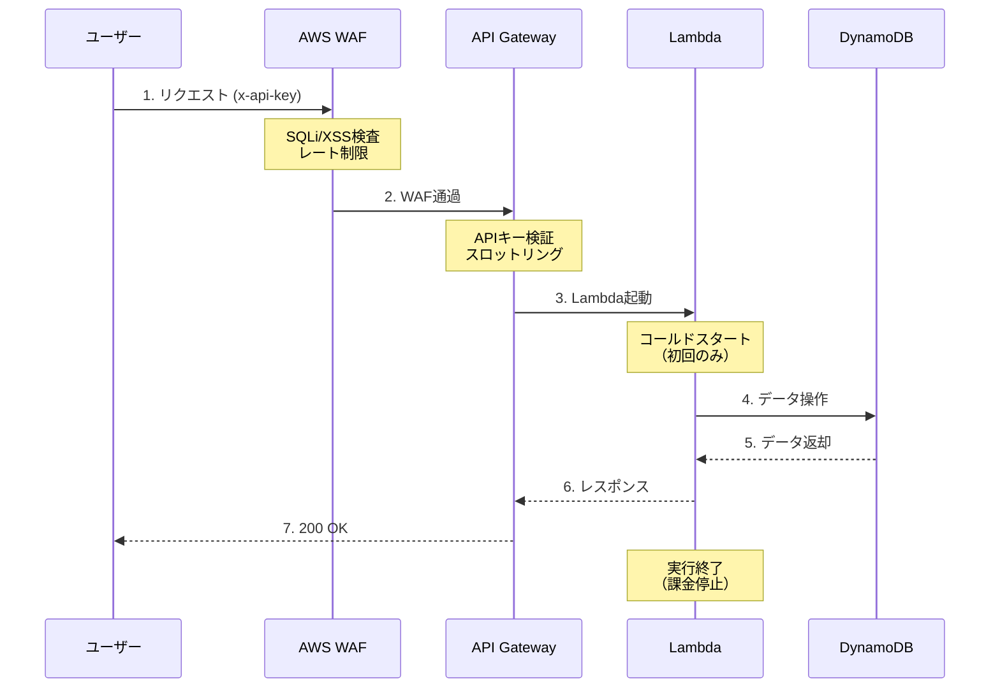
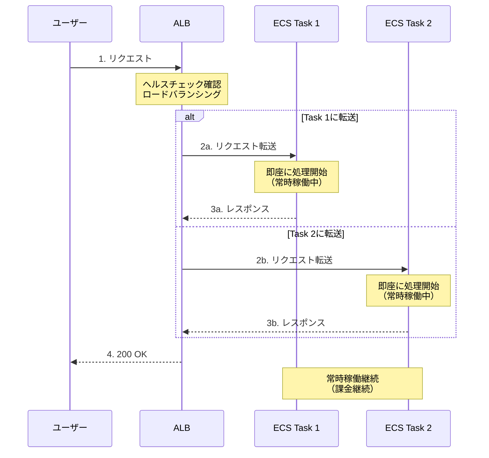

# アーキテクチャ比較: cdk-study-stack vs alb-stack

このドキュメントでは、同じTODO APIを2つの異なるアーキテクチャで実装した場合の違いを比較します。

## 目次

1. [アーキテクチャの概要](#アーキテクチャの概要)
2. [詳細比較表](#詳細比較表)
3. [リクエストフロー比較](#リクエストフロー比較)
4. [コスト比較](#コスト比較)
5. [どちらを選ぶべきか](#どちらを選ぶべきか)

---

## アーキテクチャの概要

### cdk-study-stack（API Gateway + Lambda）- サーバーレスアーキテクチャ

```
[ユーザー]
    ↓ HTTPS
[CloudFront] ← 静的コンテンツ (S3)
    ↓
[AWS WAF] ← セキュリティフィルター
    ↓
[API Gateway] ← APIキー認証
    ↓
[Lambda] ← イベント駆動実行
    ↓
[DynamoDB] ← データ保存
```

**特徴:**
- 完全サーバーレス（サーバー管理不要）
- リクエストごとに課金
- 自動スケーリング（無限スケール）
- コールドスタート（初回起動が遅い）

---

### alb-stack（ALB + ECS Fargate）- コンテナアーキテクチャ

```
[ユーザー]
    ↓ HTTP/HTTPS
[ALB] ← ロードバランサー
    ↓
[ECS Fargate] ← 常時稼働コンテナ（2台）
    ↓
[DynamoDB] ← データ保存（将来的に）
```

**特徴:**
- サーバーレスコンテナ（サーバー管理不要）
- 時間課金（常時稼働）
- 手動/自動スケーリング（上限あり）
- コールドスタートなし（常時稼働）

---

## 詳細比較表

| 項目 | cdk-study-stack (API Gateway) | alb-stack (ALB) |
|------|------------------------------|-----------------|
| **エントリーポイント** | API Gateway REST API | Application Load Balancer |
| **実行環境** | AWS Lambda (関数) | ECS Fargate (コンテナ) |
| **稼働モデル** | リクエスト時のみ実行 | 常時稼働 |
| **スケーリング** | 自動（無限） | 自動/手動（タスク数設定） |
| **起動時間** | コールドスタート: 数百ms〜数秒 | 常時稼働: 0ms |
| **実行時間制限** | 最大15分 | 制限なし |
| **VPC** | 不要（VPC Link経由で可） | 必須 |
| **ネットワーク** | パブリックエンドポイント | Public/Private Subnet構成 |
| **セキュリティグループ** | 不使用 | 使用（ALB用、ECS用） |
| **認証** | APIキー、IAM、Cognito | なし（アプリ側で実装） |
| **WAF** | API Gatewayに適用 | ALBに適用可能 |
| **ログ** | CloudWatch Logs | CloudWatch Logs |
| **監視** | CloudWatch、X-Ray | CloudWatch、Container Insights |
| **デプロイ方法** | Lambda関数更新 | Dockerイメージ更新 |
| **ローカル開発** | SAM、Lambda Docker | Docker Compose |
| **料金モデル** | リクエスト課金 | 時間課金 + LCU課金 |

---

## リクエストフロー比較

### cdk-study-stack のリクエストフロー



**特徴:**
- リクエストがない時は何も動かない（課金なし）
- リクエストごとにLambda関数が起動
- コールドスタート: 初回や一定時間後は起動に時間がかかる
- 同時リクエストは自動的に並列実行

---

### alb-stack のリクエストフロー



**特徴:**
- コンテナは常時稼働（リクエストがなくても課金）
- コールドスタートなし（即座にレスポンス）
- ALBが複数タスクに分散
- タスクの1つが異常終了しても、もう1つで継続稼働

---

## コスト比較

### シナリオ1: 小規模（月10万リクエスト）

**cdk-study-stack:**
```
API Gateway: 10万リクエスト × $3.50/百万 = $0.35
Lambda: 10万実行 × $0.20/百万 = $0.02
Lambda実行時間: 10万 × 100ms × $0.0000166667/GB秒 = $0.17
DynamoDB: オンデマンド（リクエスト量に応じて）≈ $1
CloudWatch Logs: ≈ $1

合計: 約 $2.54/月
```

**alb-stack:**
```
ALB: 730時間 × $0.0243 = $17.74
ALB LCU: 最小料金 ≈ $5.84
ECS Fargate: 2タスク × 730時間 × $0.04048 = $59.10
NAT Gateway: 730時間 × $0.062 = $45.26
CloudWatch Logs: ≈ $1

合計: 約 $128.94/月
```

**結論: 小規模なら API Gateway + Lambda が圧倒的に安い**

---

### シナリオ2: 中規模（月1000万リクエスト）

**cdk-study-stack:**
```
API Gateway: 1000万リクエスト × $3.50/百万 = $35.00
Lambda: 1000万実行 × $0.20/百万 = $2.00
Lambda実行時間: 1000万 × 100ms × $0.0000166667/GB秒 = $16.67
DynamoDB: オンデマンド ≈ $20
CloudWatch Logs: ≈ $5

合計: 約 $78.67/月
```

**alb-stack:**
```
ALB: 730時間 × $0.0243 = $17.74
ALB LCU: トラフィック増加分 ≈ $20
ECS Fargate: 2タスク × 730時間 × $0.04048 = $59.10
  （Auto Scalingでタスク増加の可能性）
NAT Gateway: 730時間 × $0.062 = $45.26
CloudWatch Logs: ≈ $5

合計: 約 $147.10/月
```

**結論: 中規模でもまだ API Gateway + Lambda が安い**

---

### シナリオ3: 大規模（月1億リクエスト）

**cdk-study-stack:**
```
API Gateway: 1億リクエスト × $3.50/百万 = $350.00
Lambda: 1億実行 × $0.20/百万 = $20.00
Lambda実行時間: 1億 × 100ms × $0.0000166667/GB秒 = $166.67
DynamoDB: オンデマンド ≈ $200
CloudWatch Logs: ≈ $50

合計: 約 $786.67/月
```

**alb-stack:**
```
ALB: 730時間 × $0.0243 = $17.74
ALB LCU: 大量トラフィック ≈ $100
ECS Fargate: 10タスク × 730時間 × $0.04048 = $295.50
  （Auto Scalingで増強）
NAT Gateway: 730時間 × $0.062 = $45.26
CloudWatch Logs: ≈ $20

合計: 約 $478.50/月
```

**結論: 大規模になると ALB + ECS Fargate の方が安くなる可能性がある**

---

## 技術的な違い

### 1. 実行モデル

**API Gateway + Lambda (cdk-study-stack):**
- **イベント駆動**: リクエストが来たら関数が起動
- **ステートレス**: 各実行は独立、状態は保持しない
- **短時間実行**: 最大15分
- **同時実行数**: デフォルト1000（リージョンごと）

```typescript
// Lambda関数 - リクエストごとに起動
export const handler = async (event) => {
  // 起動
  const result = await processRequest(event);
  // 終了（インスタンス破棄される可能性）
  return result;
};
```

**ALB + ECS (alb-stack):**
- **常時稼働**: サーバーのように常に動作
- **ステートフル可能**: メモリに状態を保持可能
- **長時間実行**: 制限なし
- **同時実行数**: タスク数 × コンテナの処理能力

```typescript
// Express.js - 常時稼働
const app = express();
app.listen(3000); // 起動したら終了しない

// グローバル変数も使える（複数リクエスト間で共有）
let cache = {};
```

---

### 2. ネットワーク構成

**API Gateway + Lambda:**
```
インターネット
    ↓
[API Gateway] ← パブリックエンドポイント
    ↓
[Lambda] ← VPC不要（オプションでVPC配置可）
```

- VPCなし: シンプル、コールドスタート高速
- VPC内配置: RDS等のVPCリソースにアクセス可能、ENI作成で起動遅延

**ALB + ECS:**
```
インターネット
    ↓
[Internet Gateway]
    ↓
[ALB - Public Subnet]
    ↓
[ECS - Private Subnet]
    ↓ NAT Gateway
外部API/インターネット
```

- VPC必須
- セキュリティグループで細かくアクセス制御
- Private Subnetで外部から隠蔽

---

### 3. スケーリング

**API Gateway + Lambda:**
```
リクエスト数: 1 → 100 → 10,000 → 1,000,000
Lambda実行数: 1 → 100 → 10,000 → 1,000,000

自動的に並列実行数が増加（ほぼ無限にスケール）
```

**ALB + ECS:**
```
リクエスト数: 1 → 100 → 10,000 → 100,000
タスク数: 2 → 5 → 20 → 50

Auto Scalingで段階的に増加
（手動設定が必要、上限あり）
```

---

### 4. デプロイ方法

**API Gateway + Lambda:**
```bash
# コード更新
npm run build
npx cdk deploy

# Lambda関数が更新される（数秒）
# トラフィックは新バージョンに自動切替
```

**ALB + ECS:**
```bash
# Dockerイメージ更新
docker build -t app .
npx cdk deploy

# 新しいタスクが起動（数分）
# ローリングアップデート（段階的に新バージョンに切替）
# 旧タスクは徐々に終了
```

---

## どちらを選ぶべきか

### API Gateway + Lambda (cdk-study-stack) を選ぶ場合

✅ **おすすめのケース:**
- サーバーレスアーキテクチャを採用したい
- リクエスト数が少ない〜中規模（月数千万リクエスト以下）
- REST APIを構築したい
- コストを最小限に抑えたい
- サーバー管理を完全に避けたい
- スパイクトラフィックに対応したい（突然の大量アクセス）

❌ **不向きなケース:**
- レイテンシが重要（コールドスタート許容できない）
- 長時間実行が必要（15分以上）
- WebSocket等の長時間接続が必要
- 大規模（月数億リクエスト）
- 既存のコンテナアプリをそのまま移行したい

---

### ALB + ECS Fargate (alb-stack) を選ぶ場合

✅ **おすすめのケース:**
- コンテナベースの開発をしたい
- 既存のDockerアプリを移行したい
- 低レイテンシが必須（コールドスタートNG）
- WebSocketや長時間接続が必要
- 大規模（月数億リクエスト以上）
- マイクロサービスアーキテクチャ
- 複雑な依存関係がある（Lambdaの50MBサイズ制限を超える）

❌ **不向きなケース:**
- リクエスト数が極端に少ない
- コストを最小限に抑えたい
- シンプルなREST APIのみ
- VPCやネットワーク設定を避けたい

---

## まとめ

### cdk-study-stack (API Gateway + Lambda)
- **哲学**: "使った分だけ払う" サーバーレス
- **強み**: 完全自動スケール、低コスト（小規模）、シンプル
- **弱み**: コールドスタート、15分制限、VPCが複雑

### alb-stack (ALB + ECS Fargate)
- **哲学**: "常時稼働するコンテナ" サーバーレスコンテナ
- **強み**: 低レイテンシ、長時間実行可、Dockerそのまま利用
- **弱み**: 固定コスト、スケーリング設定必要、VPC必須

### 両方学ぶメリット

このプロジェクトでは、**両方のアーキテクチャを実装**することで：
1. それぞれの特性を体験できる
2. ユースケースに応じた選択ができるようになる
3. AWSの多様なサービスを理解できる
4. 実際のプロジェクトで最適な構成を選べる

---

## 参考: 実際の使い分け例

### Netflix
- **メインAPI**: ECS/EKS（常時大量トラフィック）
- **画像処理**: Lambda（スパイク対応）

### Airbnb
- **検索API**: ECS（低レイテンシ必須）
- **通知処理**: Lambda（イベント駆動）

### Serverless Startup
- **全てLambda**: 初期コストを最小化
- **成長後**: 一部をECSに移行（コスト最適化）
