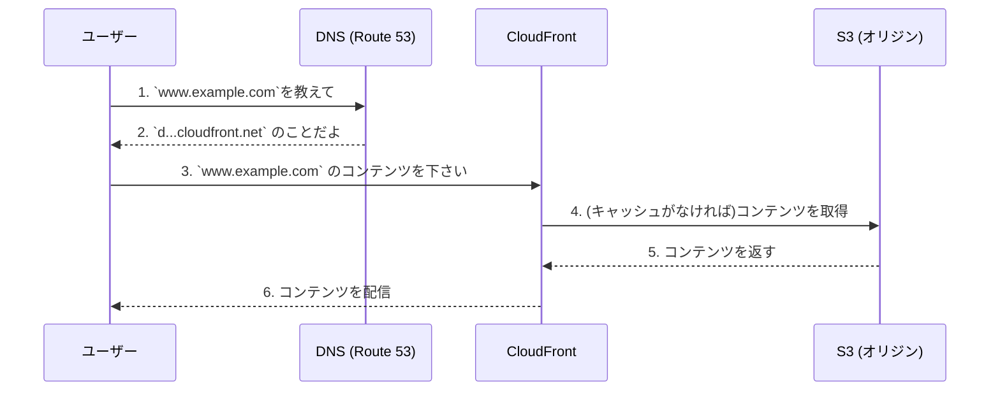

# 本番環境でのドメイン設定

このドキュメントでは、CDKで構築したアプリケーションを本番環境で運用する際のドメイン設定について解説します。

## CloudFrontのデフォルトドメイン vs カスタムドメイン

`cdk deploy` の結果として出力される `https://xxxxxxxx.cloudfront.net` のようなURLは、CloudFrontが自動で生成する**デフォルトドメイン**です。テストや開発段階ではこのままで問題ありませんが、本番環境でこのURLを直接ユーザーに公開することは一般的ではありません。

本番環境では、`www.example.com` のような、組織や個人が所有している**独自のドメイン（カスタムドメイン）**を使用します。

## 接続の仕組み

カスタムドメインをCloudFrontディストリビューションに接続するには、主に以下の2つのAWSサービスを利用します。

1.  **Amazon Route 53 (DNSサービス)**
    *   DNS設定で、`www.example.com` へのアクセスをCloudFrontのデフォルトドメイン (`xxxxxxxx.cloudfront.net`) に転送するように設定します。具体的には、`ALIAS`レコード（または`CNAME`レコード）を作成します。

2.  **AWS Certificate Manager (ACM)**
    *   `https://` でのセキュアな通信（HTTPS）を有効にするため、カスタムドメイン用の無料SSL/TLS証明書をACMで発行し、それをCloudFrontディストリビューションに紐付けます。

## 本番環境でのアクセスの流れ

## まとめ

本番環境のドメインは、表向きには**カスタムドメイン**ですが、その裏側（実体）では**CloudFrontが動いている**、というのが正しい構成です。

これらのRoute 53やACMの設定もCDKのコードとして定義し、インフラストラクチャ全体を自動で管理することが可能です。
