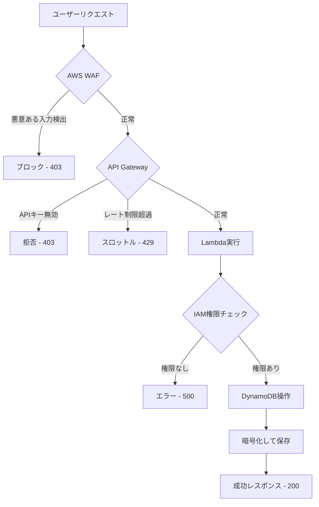
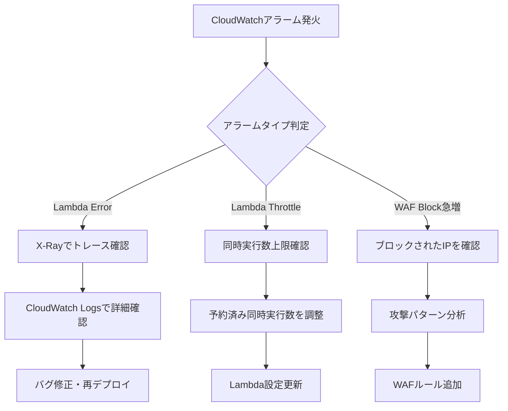

# セキュリティ機能ガイド

このドキュメントでは、TODO Appに実装されているセキュリティ機能について詳しく説明します。

## 目次

1. [セキュリティアーキテクチャ概要](#セキュリティアーキテクチャ概要)
2. [多層防御 (Defense in Depth)](#多層防御-defense-in-depth)
3. [各セキュリティ機能の詳細](#各セキュリティ機能の詳細)
4. [セキュリティのベストプラクティス](#セキュリティのベストプラクティス)
5. [監視とインシデント対応](#監視とインシデント対応)

---

## セキュリティアーキテクチャ概要

このアプリケーションは、**多層防御 (Defense in Depth)** の原則に基づいて設計されています。
各レイヤーが独立したセキュリティコントロールを提供し、一つのレイヤーが突破されても、他のレイヤーで防御できる仕組みです。

### セキュリティレイヤー

```
┌─────────────────────────────────────────────────────────┐
│ レイヤー1: ネットワーク/アプリケーション層              │
│  - AWS WAF (SQLインジェクション、XSS、DDoS対策)         │
│  - CloudFront (HTTPS強制、TLS 1.2+、セキュリティヘッダー)│
└─────────────────────────────────────────────────────────┘
                           ↓
┌─────────────────────────────────────────────────────────┐
│ レイヤー2: 認証・認可層                                 │
│  - API Gateway (APIキー認証、スロットリング)            │
│  - CORS制限 (CloudFrontドメインのみ許可)                │
└─────────────────────────────────────────────────────────┘
                           ↓
┌─────────────────────────────────────────────────────────┐
│ レイヤー3: アプリケーション層                           │
│  - Lambda (IAM最小権限、X-Rayトレーシング)              │
└─────────────────────────────────────────────────────────┘
                           ↓
┌─────────────────────────────────────────────────────────┐
│ レイヤー4: データ層                                     │
│  - DynamoDB (保存時暗号化、ポイントインタイムリカバリ)  │
│  - S3 (SSE-S3暗号化、SSL強制、パブリックアクセス禁止)   │
│  - Secrets Manager (認証情報の暗号化管理)               │
└─────────────────────────────────────────────────────────┘
                           ↓
┌─────────────────────────────────────────────────────────┐
│ レイヤー5: 監視・監査層                                 │
│  - CloudWatch (ログ、メトリクス、アラーム)              │
│  - X-Ray (分散トレーシング)                             │
│  - CloudTrail (API呼び出しの監査ログ - AWS標準)        │
└─────────────────────────────────────────────────────────┘
```

---

## 多層防御 (Defense in Depth)

### リクエストフローとセキュリティチェックポイント

APIリクエストが処理されるまでに、以下のセキュリティチェックを通過します：



各チェックポイントの詳細：

1. **WAF**: 悪意ある入力パターンを検出してブロック
2. **API Gateway**: APIキー検証とレート制限
3. **IAM**: Lambda関数がDynamoDBにアクセスする権限を検証
4. **DynamoDB**: データを暗号化して保存

---

## 各セキュリティ機能の詳細

### 1. AWS WAF (Web Application Firewall)

#### 実装内容
- **場所**: API Gateway REST API
- **スコープ**: REGIONAL（リージョン単位）

#### 適用ルール

| ルール名 | 優先度 | 目的 | 保護内容 |
|---------|--------|------|---------|
| AWSManagedRulesCommonRuleSet | 1 | OWASP Top 10対策 | SQLインジェクション、XSS、パストラバーサル、LFI/RFI |
| AWSManagedRulesKnownBadInputsRuleSet | 2 | 既知の脆弱性対策 | Log4Shell、ShellShock等 |
| RateLimitRule | 3 | DDoS緩和 | 同一IPから5分間で2000リクエスト超過時ブロック |

#### 監視方法
```bash
# WAFメトリクスを確認
aws cloudwatch get-metric-statistics \
  --namespace AWS/WAFV2 \
  --metric-name BlockedRequests \
  --dimensions Name=WebACL,Value=TodoApiWebAcl \
  --start-time $(date -u -d '1 hour ago' +%Y-%m-%dT%H:%M:%S) \
  --end-time $(date -u +%Y-%m-%dT%H:%M:%S) \
  --period 300 \
  --statistics Sum
```

---

### 2. APIキー認証

#### 実装内容
- **認証方式**: x-api-key ヘッダーによる認証
- **キー管理**: API Gateway API Keys
- **スロットリング**:
  - レート制限: 100リクエスト/秒
  - バースト制限: 200リクエスト
  - クォータ: 10,000リクエスト/日

#### APIキーの取得
```bash
# API Key IDを使ってキー値を取得
aws apigateway get-api-key \
  --api-key <ApiKeyId from CDK output> \
  --include-value \
  --query 'value' \
  --output text
```

#### リクエスト例
```bash
curl -X GET https://<api-id>.execute-api.<region>.amazonaws.com/prod/todos \
  -H "x-api-key: <your-api-key>"
```

#### エラーレスポンス

| ステータスコード | 原因 | 対処方法 |
|----------------|------|---------|
| 403 Forbidden | APIキーが無効または未設定 | 正しいAPIキーを設定 |
| 429 Too Many Requests | レート制限/クォータ超過 | リクエスト頻度を下げる |

---

### 3. データ暗号化

#### DynamoDB暗号化
- **暗号化方式**: SSE-DynamoDB (AWS管理キー)
- **暗号化範囲**: 全データ（保存時）
- **追加コスト**: なし
- **キー管理**: AWSが自動管理

```typescript
// CDKでの設定
encryption: dynamodb.TableEncryption.AWS_MANAGED
```

**仕組み:**
1. データを書き込む際、DynamoDBが自動的にAES-256で暗号化
2. データを読み取る際、自動的に復号化
3. アプリケーションコードは暗号化を意識する必要なし

#### S3暗号化
- **暗号化方式**: SSE-S3 (AWS管理キー)
- **暗号化範囲**: フロントエンドの静的ファイル
- **SSL強制**: enforceSSL: true（HTTPSでないアクセスは拒否）

#### ポイントインタイムリカバリ
- **有効範囲**: DynamoDBテーブル
- **復元可能期間**: 過去35日間
- **用途**: 誤削除やデータ破損からの復旧

```bash
# テーブルを特定の時点に復元
aws dynamodb restore-table-to-point-in-time \
  --source-table-name TodoTable \
  --target-table-name TodoTable-Restored \
  --restore-date-time "2024-01-15T12:00:00Z"
```

---

### 4. AWS Secrets Manager

#### 管理する機密情報
- APIキーのメタデータ
- 将来的な拡張用（DB認証情報、外部API鍵等）

#### 機能
- **自動暗号化**: KMSキーで暗号化
- **アクセス監査**: CloudTrailでアクセスログを記録
- **ローテーション**: 定期的なシークレット更新が可能

#### シークレット取得
```bash
# シークレット値を取得
aws secretsmanager get-secret-value \
  --secret-id <ApiKeySecretArn> \
  --query 'SecretString' \
  --output text
```

---

### 5. CloudFrontセキュリティヘッダー

#### 実装されているヘッダー

| ヘッダー | 値 | 保護内容 |
|---------|---|---------|
| X-Content-Type-Options | nosniff | MIMEスニッフィング攻撃防止 |
| X-Frame-Options | DENY | クリックジャッキング防止 |
| Referrer-Policy | strict-origin-when-cross-origin | リファラー情報漏洩防止 |
| Strict-Transport-Security | max-age=31536000; includeSubDomains; preload | HTTPS強制（1年間） |
| X-XSS-Protection | 1; mode=block | レガシーブラウザのXSS対策 |

#### HTTPS/TLS設定
- **最小TLSバージョン**: TLS 1.2
- **プロトコルポリシー**: REDIRECT_TO_HTTPS
- **サポート対象外**: SSLv3, TLS 1.0, TLS 1.1（脆弱なため）

#### ヘッダー確認方法
```bash
curl -I https://<cloudfront-domain>
```

---

### 6. CORS (Cross-Origin Resource Sharing)

#### 設定内容
```typescript
allowOrigins: ['https://*.cloudfront.net']
```

⚠️ **本番環境での推奨**: ワイルドカードではなく、具体的なドメインを指定
```typescript
allowOrigins: ['https://d123456abcdef.cloudfront.net']
```

#### 許可されるヘッダー
- Content-Type
- X-Amz-Date
- Authorization
- X-Api-Key
- X-Amz-Security-Token

---

### 7. IAM最小権限の原則

#### Lambda関数の権限

各Lambda関数には、必要最小限の権限のみを付与：

| 関数 | 付与される権限 | 範囲 |
|------|--------------|------|
| CreateTodoFunction | dynamodb:PutItem | TodoTableのみ |
| GetTodosFunction | dynamodb:Scan | TodoTableのみ（読み取り専用） |
| GetTodoByIdFunction | dynamodb:GetItem | TodoTableのみ（読み取り専用） |
| UpdateTodoFunction | dynamodb:UpdateItem | TodoTableのみ |
| DeleteTodoFunction | dynamodb:DeleteItem | TodoTableのみ |

```typescript
// CDKが自動的に最小権限を付与
table.grantReadData(getTodosFunction);   // 読み取りのみ
table.grantWriteData(createTodoFunction); // 書き込みのみ
```

---

## セキュリティのベストプラクティス

### 本番環境へのデプロイ前チェックリスト

- [ ] CORS設定を具体的なドメインに変更
  ```typescript
  allowOrigins: ['https://your-production-domain.com']
  ```

- [ ] API Keyのローテーション計画を策定
  - 推奨: 90日ごとにローテーション

- [ ] CloudWatch Alarmsに通知先を設定
  ```typescript
  alarm.addAlarmAction(new SnsAction(topic));
  ```

- [ ] WAFルールの調整
  - 本番トラフィックに応じてレート制限を調整
  - カスタムルールを追加（必要に応じて）

- [ ] S3バケットのRemovalPolicyを変更
  ```typescript
  removalPolicy: cdk.RemovalPolicy.RETAIN
  ```

- [ ] CloudFrontでカスタムドメイン＆SSL証明書を設定
  - AWS Certificate Manager (ACM) で証明書発行
  - Route 53でDNS設定

- [ ] ログの長期保管設定
  - Lambda: 現在1週間 → 本番は30日以上推奨
  - CloudFront: アクセスログの保管期間設定

### セキュリティ監査の実行

```bash
# AWS Trusted Advisorでセキュリティチェック
aws support describe-trusted-advisor-checks \
  --language en \
  --query 'checks[?category==`security`]'

# IAM Access Analyzerで過剰な権限をチェック
aws accessanalyzer list-findings \
  --analyzer-arn <analyzer-arn>
```

---

## 監視とインシデント対応

### 監視すべきメトリクス

#### 1. WAFメトリクス
- `BlockedRequests`: ブロックされたリクエスト数
- `AllowedRequests`: 許可されたリクエスト数
- `CountedRequests`: カウントされたリクエスト数

#### 2. API Gatewayメトリクス
- `4XXError`: クライアントエラー（認証失敗等）
- `5XXError`: サーバーエラー
- `Count`: 総リクエスト数
- `Latency`: レイテンシ

#### 3. Lambdaメトリクス
- `Errors`: エラー数（アラーム設定済み）
- `Throttles`: スロットリング数（アラーム設定済み）
- `Duration`: 実行時間
- `ConcurrentExecutions`: 同時実行数

### インシデント対応フロー



### ログの確認方法

```bash
# Lambda関数のログを確認
aws logs tail /aws/lambda/CreateTodoFunction --follow

# WAFのサンプルリクエストを確認
aws wafv2 get-sampled-requests \
  --web-acl-arn <web-acl-arn> \
  --rule-metric-name RateLimitRule \
  --scope REGIONAL \
  --time-window StartTime=$(date -u -d '1 hour ago' +%s),EndTime=$(date -u +%s) \
  --max-items 100
```

---

## まとめ

このアプリケーションは、以下のセキュリティ機能により、多層的に保護されています：

1. ✅ **ネットワークセキュリティ**: WAF、HTTPS、TLS 1.2+
2. ✅ **認証・認可**: APIキー、IAM最小権限、CORS制限
3. ✅ **データ保護**: 保存時暗号化（DynamoDB、S3）、転送時暗号化（TLS）
4. ✅ **機密情報管理**: Secrets Manager
5. ✅ **監視・監査**: CloudWatch、X-Ray、CloudTrail
6. ✅ **アプリケーションセキュリティ**: セキュリティヘッダー、XSS/CSP対策
7. ✅ **可用性**: DDoS対策、スロットリング、ポイントインタイムリカバリ

これらの機能により、**AWS Well-Architected Frameworkのセキュリティの柱**に準拠した、安全なアプリケーションとなっています。

---

## 参考リンク

- [AWS Well-Architected Framework - セキュリティの柱](https://docs.aws.amazon.com/wellarchitected/latest/security-pillar/welcome.html)
- [AWS WAF マネージドルール](https://docs.aws.amazon.com/waf/latest/developerguide/aws-managed-rule-groups.html)
- [DynamoDB 暗号化](https://docs.aws.amazon.com/amazondynamodb/latest/developerguide/encryption.html)
- [API Gateway セキュリティ](https://docs.aws.amazon.com/apigateway/latest/developerguide/security.html)
- [CloudFront セキュリティヘッダー](https://docs.aws.amazon.com/AmazonCloudFront/latest/DeveloperGuide/adding-response-headers.html)
